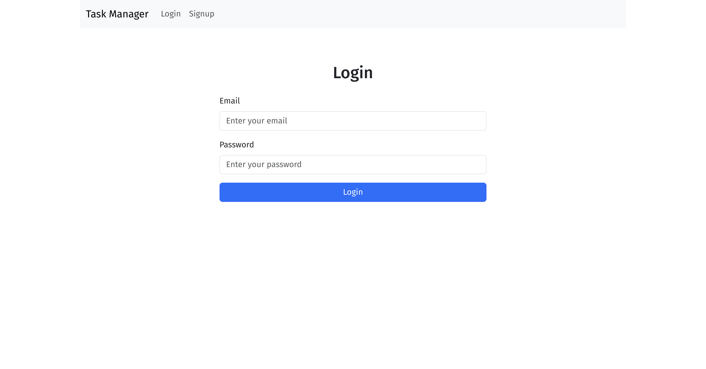
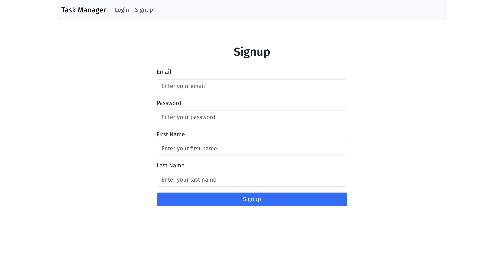
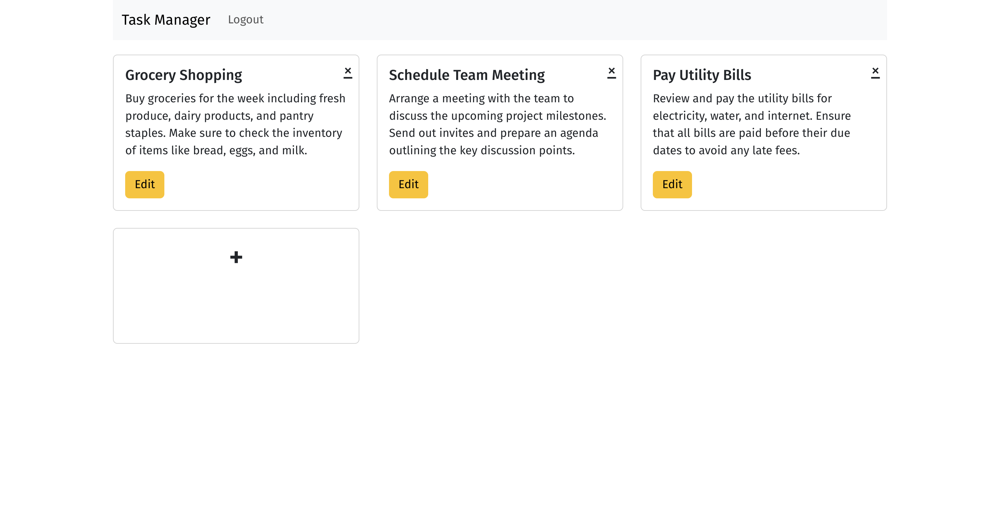
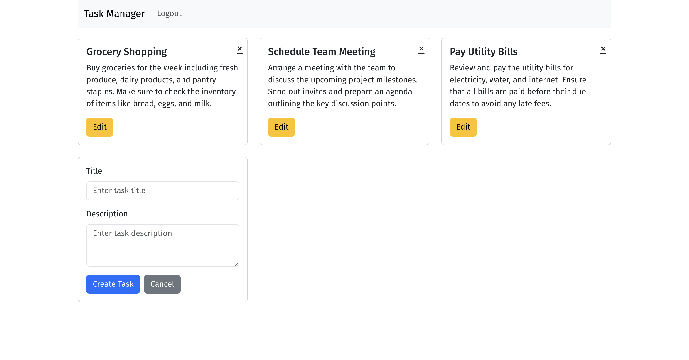

# Tasks Manager web application

This is a simple web application to manage tasks. It showcases the use of the following technologies:
* Django backend with Django REST framework
* React frontend
* Spectacular DRF and openapi-ts for API documentation and client generation

The template for this project was generated using [django-react-boilerplate](https://github.com/vintasoftware/django-react-boilerplate).

<p align="middle">
  
  
</p>
<p align="middle">
  
  
</p>

### Requirements

The application should have the following features:

1. User Authentication:
    * Users should be able to register with their email and password.
    * Users should be able to log in and log out.
2. Task Management:
    * Users should be able to create a new task with a title and description.
    * Users should be able to view a list of all their tasks.
    * Users should be able to update the title and description of their tasks.
    * Users should be able to delete a task.
3. Database:
    * Use a relational database (e.g., SQLite, MySQL) to store user and task information.
    * Each user should have their own set of tasks.

## Running the application

```bash
git clone git@github.com:bastienlc/tasks_manager.git # Clone the repository
cd tasks_manager
make docker_setup # Setup the docker environment
make docker_migrate # Apply the migrations to the database
make docker_up # Start the application

make docker_down # Stop the application
```

You can access the frontend at http://localhost:8000/. The API documentation is available at http://localhost:8000/api/schema/swagger-ui/. The admin interface is available at http://localhost:8000/admin/ (you can create a superuser with `make docker_backend_shell` then `python manage.py createsuperuser`).

If you're having trouble launching the application, you can check the template repository for more detailed instructions or contact me directly.

## Rational and design decisions

While the application is simple, I wanted to showcase the use of technologies that I am familiar with. Django is especially powerful for quickly building backend applications, and efficient as a REST API. React is one of the most popular frontend libraries. The combination of Django and React is not always straightforward, here I simply use Django to serve the React application.

Spectacular DRF and openapi-ts are super useful for documenting the API (check out http://localhost:8000/api/schema/swagger-ui/) and generating client code. This is great when the frontend and backend are in two different languages.
